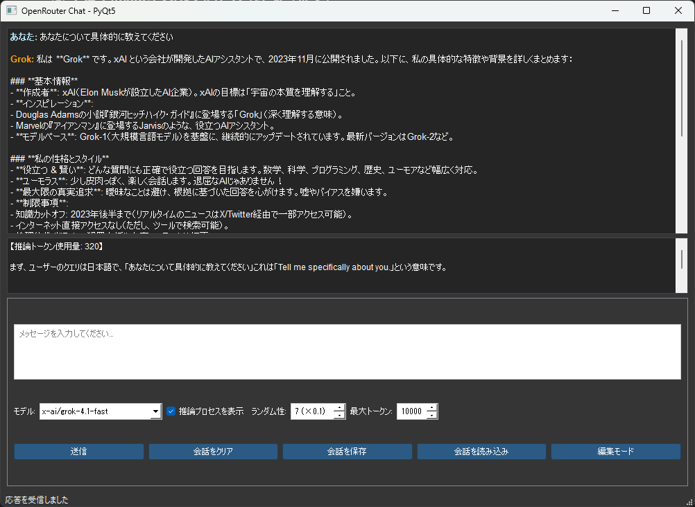

# OpenRouter Chat Client (PyQt5)



## 概要

OpenRouter API を利用した、デスクトップ向けチャットクライアントアプリです。
PyQt5 を用いて GUI を構築し、複数の LLM モデル（DeepSeek / Grok）を切り替えて利用できます。

個人学習および技術検証を目的として開発しました。

---

## 使用技術

* 言語：Python 3.x
* GUI：PyQt5
* HTTP通信：requests
* 外部API：OpenRouter API
* データ保存形式：JSON

---

## 主な機能

* チャット形式での LLM との対話
* モデル切り替え（DeepSeek / Grok）
* 推論プロセス・推論トークン数の表示（対応モデルのみ）
* 会話履歴の保存 / 読み込み（JSON）
* 会話内容の編集モード
* 非同期API通信（QThread使用）
* ダークテーマ対応UI

---

## 起動方法

### 1. リポジトリをクローン

```bash
git clone https://github.com/ユーザー名/リポジトリ名.git
cd リポジトリ名
```

### 2. 必要なライブラリをインストール

```bash
pip install PyQt5 requests
```

### 3. 環境変数を設定

OpenRouter の APIキーを環境変数に設定してください。

#### Windows (PowerShell)

```powershell
setx OPENROUTER_API_KEY "your_api_key_here"
```

#### macOS / Linux

```bash
export OPENROUTER_API_KEY="your_api_key_here"
```

### 4. アプリケーションを起動

```bash
python main.py
```

---

## 補足

* APIキーはコード内に含まれておらず、環境変数から読み込む仕様です。
* 個人開発のため、OpenRouter API の仕様変更により動作しなくなる可能性があります。
* モデル追加は、モデル選択UIおよびAPI呼び出し部分に判定ロジックを追加することで拡張可能な構成になっています。
